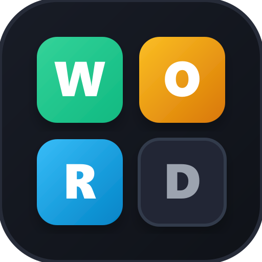

<div align="center">
  
  <h1>WORDLY — Full-Stack Real-Time Word Puzzle & 1v1 Duel Game</h1>
</div>

[](https://nextjs.org/)
[](https://react.dev/)
[](https://www.typescriptlang.org/)
[](https://tailwindcss.com/)
[](https://firebase.google.com/)

**WORDLY** is a modern, high-performance full-stack word puzzle platform inspired by Wordle. Built from the ground up with responsive design, state-of-the-art animations, multi-length word dictionaries, global leaderboards, and real-time 1v1 multiplayer duels!

---

## ✨ Features & Game Modes

### 🎮 8 Distinct Game Modes
1. **🎲 Classic Wordle**: The authentic Wordle experience with standard 5-letter words and 6 attempts.
2. **📅 Daily Challenge**: One deterministic puzzle per day seeded by the calendar date — identical for players worldwide.
3. **⏱️ Timed Rush**: A 60-second speed challenge with a live animated countdown bar, urgency pulsing states, and bonus XP for fast answers.
4. **🔥 Survival Gauntlet**: Start with 3 lives (❤️❤️❤️). Keep solving continuous words to build your ultimate streak. Miss a word and lose a heart!
5. **📈 Endless Climber**: Progressive ladder climbing from 4-letter words to 6-letter words, with attempt limits tightening down to 4 guesses.
6. **🌪️ Chaos Mode**: Dynamic modifier system with game twists:
   - **Fog of War**: Tile hints disappear after 3 seconds, forcing you to rely on memory.
   - **Speed Trap**: 35-second blitz timer.
   - **Cursed Letter**: Random common letter strictly forbidden for the round.
   - **Vowel Lock**: Every guess must contain at least 2 vowels.
   - **Sudden Death**: Only 4 attempts to guess the word.
7. **⚔️ 1V1 Multiplayer Duels**: Real-time head-to-head word race. Both players guess the same word simultaneously with live opponent progress mirrored on your screen.
8. **⚙️ Custom Game**: Customize word lengths and attempt counts, or input a secret word to generate a shareable link to challenge friends!

---

## 🚀 Tech Stack & Architecture

The project is structured into two standalone directories:

```
wordle/
├── frontend/             # Next.js 16 (App Router) client application
│   ├── src/
│   │   ├── app/          # App router pages (play, modes, daily, duel, stats)
│   │   ├── components/   # Game boards, layout, auth & leaderboard UI
│   │   ├── context/      # Firebase AuthContext (Google OAuth & profile sync)
│   │   ├── engine/       # Wordle evaluation and validation engine
│   │   └── store/        # Zustand state stores (game, player, settings)
│   └── .env.local        # Firebase web credentials (git-ignored)
│
├── backend/              # Firebase backend foundation
│   ├── firestore.rules   # Security rules for Users, Leaderboards & 1v1 Rooms
│   ├── package.json      # Node.js backend dependencies (firebase-admin)
│   └── src/index.js      # Firebase Admin SDK entry point
│
└── .gitignore            # Root gitignore protecting all secrets and builds
```

- **Framework**: [Next.js 16 (App Router)](https://nextjs.org/)
- **UI Library**: [React 19](https://react.dev/)
- **State Management**: [Zustand](https://github.com/pmndrs/zustand) with `localStorage` persistence
- **Backend & Realtime**: [Firebase](https://firebase.google.com/) (Auth, Firestore)
- **Animations**: [Framer Motion](https://www.framer.com/motion/)
- **Styling**: [Tailwind CSS v4](https://tailwindcss.com/)

---

## 🛠️ Getting Started & How to Run

### Prerequisites
Make sure you have **Node.js 18+** installed on your system.

### 1. Clone the Repository
```bash
git clone https://github.com/Hardik0385/wordle_game.git
cd wordle_game
```

### 2. Frontend Setup
```bash
cd frontend
npm install
```

Create a `frontend/.env.local` file (see `frontend/.env.example`) with your Firebase project keys:
```env
NEXT_PUBLIC_FIREBASE_API_KEY=...
NEXT_PUBLIC_FIREBASE_AUTH_DOMAIN=...
NEXT_PUBLIC_FIREBASE_PROJECT_ID=...
NEXT_PUBLIC_FIREBASE_STORAGE_BUCKET=...
NEXT_PUBLIC_FIREBASE_MESSAGING_SENDER_ID=...
NEXT_PUBLIC_FIREBASE_APP_ID=...
NEXT_PUBLIC_FIREBASE_MEASUREMENT_ID=...
```

Run the development server:
```bash
npm run dev
```
Open your browser and navigate to [http://localhost:3000](http://localhost:3000).

### 3. Backend Security Rules
Deploy or paste `backend/firestore.rules` into the Firebase Console (Firestore Database -> Rules tab).

---

## 📄 License
MIT License. Feel free to clone, customize, and extend!
